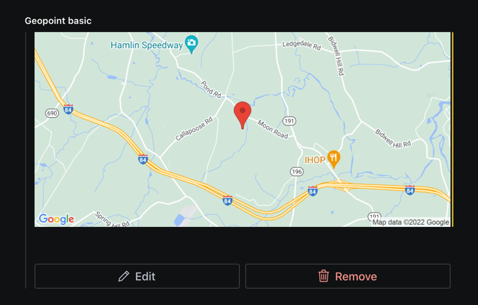

# @sanity/google-maps-input [Fork]

```diff

+ This is for those who want to have the full address information besides the coordinates.
+so the input would be a normal geopoint, where the output is a geopoint plus formated address
+and address components provided by google places api.

+ This could be used for saving adresses in sanity.

+ It is quick and dirty, probably because I don't know better but it works and it's very useful if that's what you're looking for. 

- Disabled: Setting the location by dragging or clicking on the map.
```
## Installation
```
npm install git+https://github.com/aharby/google-maps-input.git
```
## preview
### on sanity studio


### returned object


> **NOTE**
>
> This is the **Sanity Studio v3 version** of @sanity/google-maps-input.
>
> For the v2 version, please refer to the [v2-branch](https://github.com/sanity-io/sanity/tree/next/packages/%40sanity/google-maps-input).

## What is it? 
Plugin for [Sanity Studio](https://www.sanity.io) providing input handlers for geo-related input types using Google Maps.

This plugin will replace the default `geopoint` input component.



## Know issues in Studio V3

* Diff-preview is not implemented.

These will be re-added well before Studio V3 GA.

## Installation

[here](https://github.com/aharby/google-maps-input/edit/main/README.md#installation)

<del>
In your studio folder, run:

```
npm install --save @sanity/google-maps-input@studio-v3
```

or

```
yarn add @sanity/google-maps-input@studio-v3
```
</del>
## Usage

Add it as a plugin in sanity.config.ts (or .js), with a valid [Google Maps API key](https://developers.google.com/maps/documentation/javascript/get-api-key):

```js
import { googleMapsInput } from "@sanity/google-maps-input";

export default createConfig({
  // ...
  plugins: [
      googleMapsInput({
          apiKey: "my-api-key"
     })
  ] 
})
```
Ensure that the key has access to:
* Google Maps JavaScript API
* Google Places API Web Service
* Google Static Maps API

And that the key allows web-access from the Studio URL(s) you are using the plugin in. 

Note: This plugin will replace the default `geopoint` input component.

## Stuck? Get help

[](https://slack.sanity.io/)

Join [Sanity’s developer community](https://slack.sanity.io) or ping us [on twitter](https://twitter.com/sanity_io).

## License

MIT-licensed. See LICENSE.

## Develop & test

This plugin uses [@sanity/plugin-kit](https://github.com/sanity-io/plugin-kit)
with default configuration for build & watch scripts.

See [Testing a plugin in Sanity Studio](https://github.com/sanity-io/plugin-kit#testing-a-plugin-in-sanity-studio)
on how to run this plugin with hotreload in the studio.

### Release new version

Run ["CI & Release" workflow](https://github.com/sanity-io/google-maps-input/actions/workflows/main.yml).
Make sure to select the main branch and check "Release new version".
